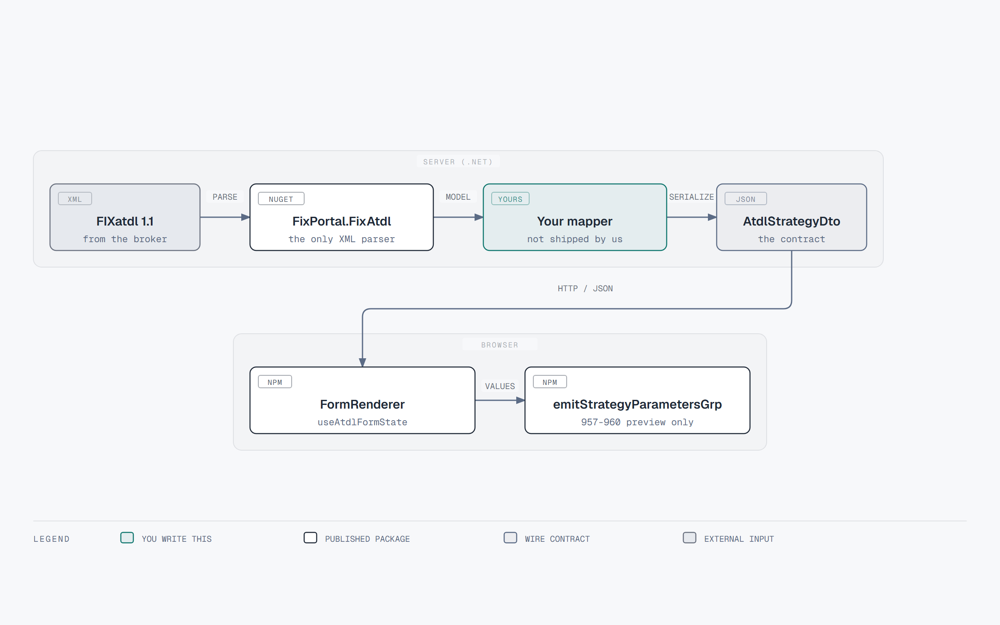

# Getting a strategy into `@fix-portal/fixatdl-react`

> This package never parses FIXatdl XML. The host backend parses with
> [`FixPortal.FixAtdl`](https://github.com/FixPortal/fixportal-fixatdl)
> and maps the resulting `Strategy_t` into the JSON `AtdlStrategyDto`
> this page describes. The C# DTO of the same name lives in FixPortal
> Simulator, not in the core NuGet package — an OSS host writes its own
> mapper.

A worked JSON example is
[`src/__fixtures__/twap-strategy.json`](https://github.com/FixPortal/fixportal-fixatdl-react/blob/main/src/__fixtures__/twap-strategy.json).

## Pipeline

Source: [`docs/diagrams/strategy-dataflow.html`](diagrams/strategy-dataflow.html) — open in a browser to edit, then re-export.

Do not stringify `ClockValue` objects on the way back. Use
`clockWireValue` / `mapControlValuesToParameters` when converting form
state to parameter values.

## `AtdlStrategyDto`

| Field | Required | Maps from |
|---|---|---|
| `name` | yes | `Strategy_t.Name` |
| `description` | yes, nullable | `Strategy_t.Description` text |
| `parameters` | yes | `Strategy_t.Parameters` |
| `panel` | yes | `Strategy_t.StrategyLayout.StrategyPanel` |
| `sourceXml` | yes | Original strategy XML fragment (identity; state resets when it changes) |
| `strategyEdits` | no | `Strategy_t.StrategyEdits` |

## `AtdlParameterDto`

| Field | Maps from | Notes |
|---|---|---|
| `name` | `IParameter.Name` | Emitter keys on **parameter name**, not control id. |
| `fixTag` | `IParameter.FixTag` | `null` = local to the form, never emitted. |
| `type` | parameter `xsi:type` local name | `Int_t`, `UTCTimestamp_t`, … |
| `enumValues` | `EnumPair` collection | `{ enumId, wireValue }` |
| `min` / `max` | parameter bounds | Native type; percentages are the **wire** fraction unless `multiplyBy100`. |
| `precision` | decimal precision | |
| `mutableOnCxlRpl` | `MutableOnCxlRpl` | `false` locks the control when `isAmendment`. |
| `useValue` | `Use_t` | `"required"` / `"optional"` / `null`. |
| `defaultValue` | default / init | |
| `trueWireValue` / `falseWireValue` | Boolean mappings | |
| `invertOnWire` | inverted list | |
| `constValue` | constant parameter | **Wins** over filled form values in the preview emitter. |
| `minLength` / `maxLength` | string length | |
| `multiplyBy100` | `Percentage_t` display | |
| `localMktTz` | IANA zone | Daily bounds and clocks. |

## `AtdlControlDto`

| Field | Maps from | Notes |
|---|---|---|
| `id` | `Control_t.Id` | Must be nonempty and unique in the strategy. |
| `type` | control `xsi:type` | One of the 15 names in the registry. |
| `label` | `Label` | Rendered as React text, never HTML. |
| `parameterRef` / `parameter` | `ParameterRef` | Embed the resolved parameter DTO when present. |
| `listItems` | `ListItem`s | `{ enumId, uiRep }` |
| `initValue` | `InitValue` | |
| `stateRules` | `StateRule`s | See below. |
| `tooltip` | `ToolTip` | |
| `checkedEnumRef` / `uncheckedEnumRef` | binary enum refs | |
| `radioGroup` | `RadioButton_t.RadioGroup` | Shared-parameter radios. |
| `increment` / `innerIncrement` / `outerIncrement` | spinner/slider | |
| `initPolicy` / `initFixField` / `initValueMode` | `UseFixField` init | `initValueMode=1` needs a host `clock`. |
| `localMktTz` | clock zone | |

## Panels

`AtdlPanelDto`: `title`, `border`, `orientation`, `collapsible`,
`collapsed`, `children`.

Each child is a discriminated union: `{ kind: 'panel', … }` or
`{ kind: 'control', … }`. Recurse; `flattenControls` walks this tree
in document order.

## State rules and edits

`AtdlStateRuleDto.effect` is exactly one of `enabled`, `visible`,
`value`. For the first two, `targetValue` is the boolean payload; for
`value`, `targetStringValue` is the payload (`targetValue` is unused
`false`). `{NULL}` as the value payload clears the control.

`StateRuleAstNodeDto` is the wire AST (`kind`, `operator`, `field`,
`value`, `children`, optional `field2` / `comparisonType`). The
evaluator uses a parallel `StateRuleAstNode` type; hosts building a
rules inspector should go through `collectRuleRows` rather than
evaluating the DTO by hand.

## What the host still owns

- Schema validation of the XML (the core library does not ship the XSD).
- Mapping `Strategy_t` → this JSON. There is no published OpenAPI.
- Authoritative FIX serialization. `emitStrategyParametersGrp` is a
  preview of tags 957–960 and **throws** if a name or value contains
  SOH. Direct parameter tags and the rest of the order are yours.
- Supplying `clock` for time-only clocks and `initValueMode=1`.
- Remounting `<FormRenderer key={orderId} …>` when switching orders.
